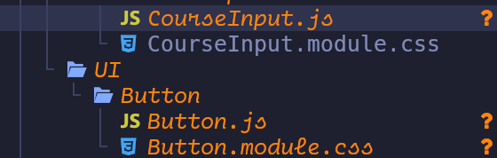
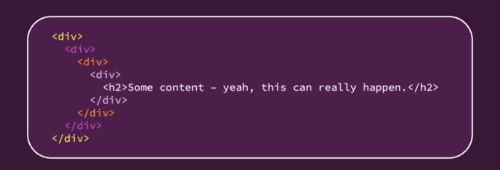
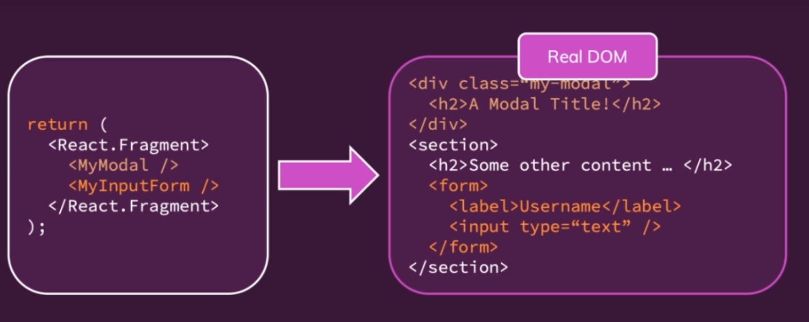

- > Author(s): [[Maximilian Schwarzmüller]]
  Url: [[https://www.udemy.com/course/react-the-complete-guide-incl-redux/]]
  Source code: [https://github.com/academind/react-complete-guide-code](https://github.com/academind/react-complete-guide-code) 
  tags:: #course #programming #[[software development]]
- #### Section 2: Javascript Refresher
  id:: 646e12dc-d932-4b17-98f6-c2d1da781f06
	- `let` and `const` #Javascript/syntax
		- > Use `let` if you want create a something a that is a variable
		- > Use `const` if you are planning on creating a constant value
		- ```js
		  const myName = 'Max';
		  console.log(myName);
		  
		  myName = 'Manu';
		  console.log(myName);
		  // TypeError: Assignment to constant variable.
		  
		  let secName = 'Max';
		  console.log(myName);
		  
		  secName = 'Manu';
		  console.log(myName);
		  // variable secName change to 'Manu'.
		  ```
	- `Arrow Functions` #Javascript/syntax
		- ```js
		  // Tranditional function
		  function printMyName(name) {
		    console.log(name);
		  }
		  
		  printMyName('Max');
		  
		  // Arrow function
		  const printMyName = name => {
		    console.log(name);
		  }
		  
		  printMyName('Max');
		  // Parentheses-less function
		  const printMyName = () => {
		    console.log("Max");
		  }
		  
		  printMyName('Max');
		  // One-liner
		    const multiply = (number) => number * 2;
		  ```
	- `Exports` & `Imports` #Javascript/syntax #Javascript/module
		- `person.js`
			- ```js
			  const person = {
			    name: 'Max'
			  }
			  
			  export default person
			  ```
		- `utility.js`
			- ```js
			  export const clean = () => {
			    return
			  }
			  
			  export const baseData = 10;
			  ```
		- `app.js`
			- **Default export**
				- ```js
				  // import with the name whatever we want
				  import person from './person.js'
				  import prs from './person.js'
				  ```
			- **Named export**
				- ```js
				  // import the stuff by its name
				  import { baseData } from './utility.js'
				  import { clean } from './utility.js'
				  
				  // import alias
				  import { baseData as bD } from './utility.js'
				  
				  // import as bundle
				  import * as bundled from './utility.js'
				  bundled.baseData
				  ```
	- `Classes` #Javascript/syntax #Javascript/OOP
		- ```js
		  class Human {
		    gender = 'male';
		  
		    printGender = () => {
		      console.log(this.gender);
		    }
		  }
		  
		  // Inheritance
		  class Person extends Human {
		    // calling constructor functoin behind the scene
		    name = 'Max';
		    gender = 'female';
		  
		    printMyName = () => {
		      console.log(this.name);
		    }
		  }
		  
		  const person = new Person();
		  // calling method from the class `Person`
		  person.printMyName(); // 'Max'
		  person.printGender(); // 'female'
		  ```
	- `Spread` & `Rest` Operator #Javascript/syntax
		- > `Spread` operator used to split up array elements *OR* object properties
			- ```js
			  // Spread operator
			  const numbers = [1, 2, 3];
			  const newNumbers = [...numbers, 4];
			  
			  console.log(newNumbers); // [1, 2, 3, 4]
			  
			  // Spread operator
			  const person = {
			    name: 'Max'
			  }
			  
			  const newPerson = {
			    ...person,
			    age: 28
			  }
			  
			  console.log(newPerson);
			  // [object Object] {
			  //   age: 28,
			  //   name: "Max",
			  // }
			  ```
		- `Rest` operator used to merge a list of function arguments into an array
			- ```js
			  // Rest operator
			  // filter all element in the array except 1
			  const filter = (...args) => {
			    return args.filter(el => el === 1);
			  }
			  
			  console.log(filter(1, 2, 3)); // [1]
			  ```
	- `Destructuring`
		- > `Destructuring` easily extract array elements *OR* object properties and store them in variables
		- ```js
		  // Array destructuring
		  [a, b] = ['Hello', 'Max']
		  console.log(a) // 'Hello'
		  console.log(b) // 'Max'
		  
		  // Array destructuring
		  const numbers = [1, 2, 3];
		  [num1, , num3] = numbers;
		  console.log(num1, num3);
		  // 1
		  // 3
		  ```
	- `Array Methods` #Javascript/syntax #Javascript/array
		- > `array.map()` take a function as a input and execute on every element on the array
			- ```js
			  const numbers = [1, 2, 3];
			  
			  // take a function as a input and execute on every element on the array
			  const doubleNumArray = numbers.map((num) => {
			    return num * 2;
			  })
			  
			  console.log(numbers); // [1, 2, 3]
			  console.log(doubleNumArray); // [2, 4, 6]
			  ```
- #### Section 3: React Components Basics
  id:: 64706f4e-1a1b-4dd0-bf6c-a0aea14002af
	- **First Component** #React/Component
		- Create our first custom component
			- ```jsx
			  function ExpenseItem() {
			    return <h2>Expense item!</h2>
			  }
			  
			  export default ExpenseItem;
			  ```
		- Use `export default` to export the `ExpenseItem` Component
		-
		- Reuse custom component `<ExpenseItem>` at `App.js` with `import`
			- ```jsx
			  import ExpenseItem from "./ExpenseItem";
			  
			  function App() {
			    return (
			      <div>
			        <h2>Let's get started!</h2>
			        <ExpenseItem></ExpenseItem>
			      </div>
			    );
			  }
			  
			  export default App;
			  ```
	- #### Root element #React/Component
		- > There must be only one root element exist in the *react component*
			- ```jsx
			  function ExpenseItem() {
			    // More than one root element, doesn't work
			    return <div>Date
			    </div>
			      <div><h2>Title</h2><div>Amount</div></div>;
			  }
			  
			  export default ExpenseItem;
			  ```
		- One root element *react component*
			- ```jsx
			  function ExpenseItem() {
			    return (
			      <div>
			        <div>Date</div>
			        <div>
			          <h2>Title</h2>
			          <div>Amount</div>
			        </div>
			      </div>
			    );
			  }
			  
			  export default ExpenseItem;
			  ```
	- #### Css styling to Component #React/Component #React/Styling
		- > [[$red]]==.css== file must be explicitly tell **React** to *inject* to the application
		- use `import` to inject the [[$red]]==.css== file to the component directly
			- ```jsx
			  import "./ExpenseItem.css";
			  
			  function ExpenseItem() {
			    return (
			  	...
			    );
			  }
			  
			  export default ExpenseItem;
			  ```
			- #+BEGIN_IMPORTANT
			  Notice that **React** use `className` instead of `class`, because the code inside `return(...)` is [[$red]]==jsx== but not [[$red]]==html== code
			  #+END_IMPORTANT
	- #### Displaying with Expressions #React/Component
		- **React** component can display data with `{}`  {{cloze (expression)}}
			- ```jsx
			  function ExpenseItem() {
			    // js code should place inside the function component
			    const expenseDate = new Date(2021, 2, 28);
			    const expenseTitle = "Car Insurance";
			    const expenseAmount = 294.67;
			  
			    return (
			      <div className="expense-item">
			        <div>{expenseDate.toISOString()}</div>
			        <div className="expense-item__description">
			          <h2>{expenseTitle}</h2>
			          <div className="expense-item__price">${expenseAmount}</div>
			        </div>
			      </div>
			    );
			  }
			  
			  export default ExpenseItem;
			  ```
	- DOING Passing data with `props` #React/Component #React/State
	  :LOGBOOK:
	  CLOCK: [2023-05-27 Sat 13:04:48]
	  :END:
		- declare *expenses* for component data
			- ```jsx
			  const expenses = [
			      {
			        id: "e1",
			        title: "Toilet Paper",
			        amount: 94.12,
			        date: new Date(2020, 7, 14),
			      },
			      { id: "e2", title: "New TV", amount: 799.49, date: new Date(2021, 2, 12) },
			      {
			        id: "e3",
			        title: "Car Insurance",
			        amount: 294.67,
			        date: new Date(2021, 2, 28),
			      },
			      {
			        id: "e4",
			        title: "New Desk (Wooden)",
			        amount: 450,
			        date: new Date(2021, 5, 12),
			      },
			    ];
			  ```
		- passing the *expenses* data to the component through `{}`
			- ```jsx
			  import ExpenseItem from "./ExpenseItem";
			  
			  function App() {
			    return (
			      <div>
			        <h2>Let's get started!</h2>
			        <ExpenseItem
			          title={expenses[0].title}
			          amount={expenses[0].amount}
			          date={expenses[0].date}
			        ></ExpenseItem>
			        <ExpenseItem
			          title={expenses[1].title}
			          amount={expenses[1].amount}
			          date={expenses[1].date}
			        ></ExpenseItem>
			        <ExpenseItem
			          title={expenses[2].title}
			          amount={expenses[2].amount}
			          date={expenses[2].date}
			        ></ExpenseItem>
			        <ExpenseItem
			          title={expenses[3].title}
			          amount={expenses[3].amount}
			          date={expenses[3].date}
			        ></ExpenseItem>
			      </div>
			    );
			  }
			  
			  export default App;
			  ```
		- In [[$red]]==ExpenseItem.js== handle the props.date data passed by [[$red]]==App.js==
			- ```jsx
			  import "./ExpenseItem.css";
			  
			  function ExpenseItem(props) {
			    return (
			      <div className="expense-item">
			        <div>{props.date.toISOString()}</div>
			        <div className="expense-item__description">
			          <h2>{props.title}</h2>
			          <div className="expense-item__price">${props.amount}</div>
			        </div>
			      </div>
			    );
			  }
			  
			  export default ExpenseItem;
			  ```
	- #### DOING Splitting multiple component #React/Component
	  :LOGBOOK:
	  CLOCK: [2023-05-27 Sat 13:04:44]
	  :END:
		- draw
		- In [[$red]]==ExpenseItem.js==
			- ```jsx
			  function ExpenseItem(props) {
			    return (
			      <div className="expense-item">
			        <ExpenseDate date={props.date} />
			   		...
			      </div>
			    );
			  }
			  ```
		- In [[$red]]==ExpenseDate.js==
			- ```jsx
			  import "./ExpenseDate.css";
			  
			  function ExpenseDate(props) {
			    const month = props.date.toLocaleString("en-US", { month: "long" });
			    const day = props.date.toLocaleString("en-US", { day: "2-digit" });
			    const year = props.date.getFullYear();
			  
			    return (
			      <div className="expense-date">
			        <div className="expense-date__month">{month}</div>
			        <div className="expense-date__day">{day}</div>
			        <div className="expense-date__year">{year}</div>
			      </div>
			    );
			  }
			  
			  export default ExpenseDate;
			  ```
	- #### Wrapper component #React/Component
		- **To create reusable component, there are few points to remind**
			- In [[$red]]==Card.js==, we need to add `props.children` to simulate the act of `div` wrapping the children
				- ```jsx
				  ...
				  
				  function Card(props) {
				  	...
				    return <div className={classes}>{props.children}</div>;
				  }
				  
				  export default Card;
				  ```
			- Unlike **html tags**, we also need to pass the class name into the custom component with `props`
				- ```jsx
				  ...
				  
				  function Card(props) {
				    const classes = "card " + props.className;
				    return ...;
				  }
				  
				  export default Card;
				  ```
		- **Usage of the wrapper component**
			- ```jsx
			  function ExpenseItem(props) {
			    return (
			      <Card className="expense-item">
			          ...
			      </Card>
			    );
			  }
			  ```
- #### Section 4: React State & Events
  id:: 6471c9a5-c112-48f7-b8ce-849f01ec1926
	- Adding `Event Listener` #React/Component #React/DOM #React/Event
		- In **React**, event listener is added in jsx with the property provided by **React** such as `onClick`, `onBlur`, etc...
			- ```jsx
			  const ExpenseItem = (props) => {
			    const clickHandler = () => {
			      console.log("Clicked !!!");
			    };
			    return (
			      <Card className="expense-item">
			  		...
			        <button onClick={clickHandler}>Change Title</button>
			      </Card>
			    );
			  };
			  
			  ```
	- > Component function are just *function call* #React/Component #React/State
		- React doesn't rerender whenever the values of the `props` change
			- ```jsx
			  const ExpenseItem = (props) => {
			    let title = props.title;
			  
			    // not update due to how react works
			    const clickHandler = () => {
			      title = "Updated";
			    };
			    return (
			      <Card className="expense-item">
			        <div className="expense-item__description">
			          <h2>{title}</h2>
			        </div>
			        <button onClick={clickHandler}>Change Title</button>
			      </Card>
			    );
			  };
			  ```
	- First React `State` #React/State #React/Hook
		- We create state in **React** using `useState`
			- ```jsx
			    const [title, setTitle] = useState(props.title);
			  ```
			- `useState` create a *special* variable where changes will lead the component function to be executed again
			- To change the variable, instead of using `title = 'something'`, in **React** we need to call the special functoin `setTitle()` to set the value of the variable and tell **React** to re-evaluated this component function
		- **==Example usage==**
			- ```jsx
			  const ExpenseItem = (props) => {
			    const [title, setTitle] = useState(props.title);
			  
			    const clickHandler = () => {
			      setTitle("Clicked !!!");
			    };
			    return (
			      <Card className="expense-item">
			        <div className="expense-item__description">
			          <h2>{title}</h2>
			        </div>
			        <button onClick={clickHandler}>Change Title</button>
			      </Card>
			    );
			  };
			  
			  export default ExpenseItem;
			  
			  ```
	-
	- Updating multiple `State` #React/State #React/Hook
		- setting a variable that store multiple `State`
			- ```jsx
			    const [userInput, setUserInput] = useState({
			      enteredTitle: "",
			      enteredAmount: "",
			      enteredDate: "",
			    });
			  ```
		- Update `handler` to the following
			- ```jsx
			    const DateChangeHandler = (event) => {
			      // setEnteredDate(event.target.value);
			      setUserInput((prevState) => {
			        return { ...prevState, enteredDate: event.target.value };
			      });
			    };
			  ```
	- Two-Way Binding #React/State
		- ```jsx
		            <input
		              type="text"
		              value={userInput.enteredTitle}
		              onChange={titleChangeHandler}
		            />
		  ```
		- ```jsx
		    const titleChangeHandler = (event) => {
		      // setEnteredTitle(event.target.value);
		      // React gives latest snapshot of the state
		      setUserInput((prevState) => {
		        return { ...prevState, enteredTitle: event.target.value };
		      });
		    };
		  ```
	- *Bottom-up* communication #React/State
		- First create a `Handler` from the parent component
			- ```jsx
			    const saveExpenseDataHandler = (enteredExpenseData) => {
			      const expenseData = {
			        ...enteredExpenseData,
			        id: Math.random().toString(),
			      };
			      console.log(expenseData);
			      props.onAddExpense(expenseData);
			    };
			  ```
		- Passing the `Handler` through props to children component
			- ```jsx
			  <div className="new-expense">
			        <ExpenseForm onSaveExpenseData={saveExpenseDataHandler} />
			      </div>
			  ```
		- Calling the `Handler` from the children component
			- ```jsx
			    const submitHandler = (event) => {
			      event.preventDefault();
			  	...
			      props.onSaveExpenseData(expenseData);
			      ...
			    };
			  ```
- #### Section 5: React LIst & Conditional content
  id:: 6472005c-32d1-405a-ae78-73c6fabe5250
	- Understanding *"Keys"* #React/State
		- Working with array of data, if we not passing *key* to generate a list component, Whenever the array content changed, React will simply **revisit** the list of content and update the content to match the array
		- Here is the example of generating components with *key*, *key* is a special `props` that can add to any component
			- ```jsx
			  {props.items.map((expense) => (
			    <ExpenseItem
			      key={expense.id}
			      title={expense.title}
			      amount={expense.amount}
			      date={expense.date}
			    />
			  ))}
			  ```
		- #+BEGIN_IMPORTANT
		  Don't use `index` from array.map() as the `index` is not directly attached to the content of the item
		  #+END_IMPORTANT
	- Output conditional content #React/State
		- Create an variable `expensesContent` to store default value
			- ```jsx
			   let expensesContent = <p>No expenses found.</p>;
			  ```
		- Conditional statement to check the `filteredExpenses` affect by the state `filteredYear`
			- `filteredExpenses`
				- ```jsx
				  const filteredExpenses = props.items.filter((expense) => {
				    return expense.date.getFullYear().toString() === filteredYear;
				  });
				  ```
			- `filteredYear`
				- ```jsx
				  if (filteredExpenses.length > 0) {
				    expensesContent = filteredExpenses.map((expense) => (
				      <ExpenseItem
				        key={expense.id}
				        title={expense.title}
				        amount={expense.amount}
				        date={expense.date}
				      />
				    ));
				  }
				  ```
			- ```jsx
			  return (
			    <Card className="expenses">
			      <ExpensesFilter
			        selected={filteredYear}
			        onChangeFilter={filterChangeHandler}
			      />
			      {expensesContent}
			    </Card>
			  );
			  ```
	- Passing style in jsx #React/Component #React/Styling
		- In ==jsx== style are passed as an `object`
			- ```jsx
			  <div
			    className="chart-bar__fill"
			    style={{ height: barFillHeight }}
			  ></div>
			  ```
		- #+BEGIN_NOTE
		  For long property name with `-` like `background-color`, the property need to wrap with `''` e.g. *`'background-color'`* *or* use camel-case *`backgroundColor`*
		  #+END_NOTE
- #### Section 6: Styling React Components
  id:: 647881d0-a031-4333-b194-3ecb50c83dec
	- #+BEGIN_IMPORTANT
	  By default in *React*, the imported css styles are **not scoped**, that's mean the styles are **spilled** throughout the entire project.
	  #+END_IMPORTANT
	- #### Styled Components #React/Styling #Styled-Comopnents
	  collapsed:: true
		- Creating component with *styled components*
		  collapsed:: true
			- ```jsx
			  import styled from "styled-components";
			  const Button = styled.button`
			    width: 100%;
			    font: inherit;
			    padding: 0.5rem 1.5rem;
			    border: 1px solid #8b005d;
			    color: white;
			    background: #8b005d;
			    box-shadow: 0 0 4px rgba(0, 0, 0, 0.26);
			    cursor: pointer;
			  
			    @media (min-width: 768px) {
			      width: auto;
			    }
			  
			    &:focus {
			      outline: none;
			    }
			  
			    &:hover,
			    &:active {
			      background: #ac0e77;
			      border-color: #ac0e77;
			      box-shadow: 0 0 8px rgba(0, 0, 0, 0.26);
			    }
			  `;
			  ```
		- Passing `props` to styled component
		  collapsed:: true
			- ```jsx
			        <FormControl invalid={!isValid}>
			          <label>Course Goal</label>
			          <input type="text" onChange={goalInputChangeHandler} />
			        </FormControl>
			  
			  ```
		- Change the value with the `props`
		  collapsed:: true
			- ```jsx
			  const FormControl = styled.div`
			  	...
			  
			    & label {
			      font-weight: bold;
			      display: block;
			      margin-bottom: 0.5rem;
			      color: ${(props) => (props.invalid ? "red" : "black")};
			    }
			  
			    & input {
			      display: block;
			      width: 100%;
			      border: 1px solid ${(props) => (props.invalid ? "red" : "#ccc")};
			      background: ${(props) => (props.invalid ? "#ffd7d7" : "transparent")};
			      font: inherit;
			      line-height: 1.5rem;
			      padding: 0 0.25rem;
			    }
			  	....
			  `
			  ```
	- #### CSS Module  #React/Styling #CSS/CSS-Module
	  collapsed:: true
		- First we need to convert the regular **.css** file to **.module.css** file
		  collapsed:: true
			- 
		- Import css module
		  collapsed:: true
			- ```jsx
			  import styles from "./CourseInput.module.css";
			  ```
		- Using the styles class with `styles.prop` or `styles['props']`
		  collapsed:: true
			- ```jsx
			  <button type={props.type} className={styles.button} onClick={props.onClick}>
			  	...
			  </button>
			  ```
			- ```jsx
			  <div
			    className={`${styles["form-control"]} ${!isValid && styles.invalid}`}
			  >
			  	...
			  </div>
			  ```
	-
- #### Section 7: JSX limitation workaround
  id:: 6481c90c-ee15-48d9-90c5-762defa7a705
	- #### React Fragment #React/Component
	  collapsed:: true
		- #+BEGIN_NOTE
		  Due to the limitation of jsx, which is a **component should consist of one root element**. Most of the, the app will end of with a lot of unnecessary `<div>`
		  #+END_NOTE
		  {:height 218, :width 672}
		-
		- Using `React.Fragment`
		  collapsed:: true
			- ```jsx
			  return (
			    <React.Fragment>
			      <AddUser onAddUser={addUserHandler} />
			      <UsersList users={usersList} />
			    </React.Fragment>
			  );
			  ```
		- Using `<>`
		  collapsed:: true
			- ```jsx
			  return (
			    <>
			      <AddUser onAddUser={addUserHandler} />
			      <UsersList users={usersList} />
			    </>
			  );
			  ```
	- #### React portals #React/DOM
	  collapsed:: true
		- **Portals**, the name has suggested, that act as an portal for the Component to place on another location to improve the semantics of *HTML* {:height 360, :width 1113}
		- To create the place for the portal, we have to go to `public/index.html` to define
		  collapsed:: true
			- ```jsx
			  <body>
			      <noscript>You need to enable JavaScript to run this app.</noscript>
			      <div id="backdrop-root"></div>
			      <div id="overlay-root"></div>
			      <div id="root"></div>
			      <!--
			        This HTML file is a template.
			        If you open it directly in the browser, you will see an empty page.
			  
			        You can add webfonts, meta tags, or analytics to this file.
			        The build step will place the bundled scripts into the <body> tag.
			  
			        To begin the development, run `npm start` or `yarn start`.
			        To create a production bundle, use `npm run build` or `yarn build`.
			      -->
			    </body>
			  ```
		- Import `ReactDOM` inside component
		  collapsed:: true
			- ```jsx
			  import ReactDOM from "react-dom";
			  ```
		- Placing the component to the portal with `ReactDOM.createPortal()`
		  collapsed:: true
			- ```jsx
			  {ReactDOM.createPortal(
			    <Backdrop onConfirm={props.onConfirm} />,
			    document.getElementById("backdrop-root")
			  )}
			  {ReactDOM.createPortal(
			    <ModalOverlay
			      onConfirm={props.onConfirm}
			      title={props.title}
			      message={props.message}
			    />,
			    document.getElementById("overlay-root")
			  )}
			  ```
	- #### React useRef
	  collapsed:: true
		- `useRef` allow to access other DOM elements
		- creating ref
		  collapsed:: true
			- ```jsx
			    const nameInputRef = useRef();
			    const ageInputRef = useRef();
			  ```
		- accessing ref value
		  collapsed:: true
			- ```jsx
			      const enteredName = nameInputRef.current.value;
			      const enteredUserAge = ageInputRef.current.value;
			  
			      if (enteredName.trim().length === 0 || enteredUserAge.trim().length === 0) {
			  		...
			      }
			  
			  ```
		- manipulating ref value
		  collapsed:: true
			- ```jsx
			  nameInputRef.current.value = "";
			  ageInputRef.current.value = "";
			  ```
			- #+BEGIN_WARNING
			  Except reset the input value, you **should not** manipulate the DOM without React
			  #+END_WARNING
	- #### Controlled Components, Uncontrolled Components
	  collapsed:: true
		- If we access the dom element with `ref`, it's **uncontrolled component**, because it's internal *state* is not controlled by react
		  collapsed:: true
			- ```jsx
			  <input id="username" type="text" ref={nameInputRef} />
			  <input id="age" type="number" ref={ageInputRef} />
			  ```
		- otherwise, like *2-way binding*, we can updating and feed back the state to the component, it's a **controlled component**
- #### Section 8: Side Effects, Reducer, Context
  id:: 6481c91f-619f-43cd-86e1-3744b5e65041
	- #### Side Effects
		- Here is the main jobs of React
			- {{renderer excalidraw, excalidraw-2023-06-08-22-08-39}}
		- Side effects is **anything besides** that
			- {{renderer excalidraw, excalidraw-2023-06-08-22-14-20}}
	- #### useEffect #React/Hook #[[React/Side Effect]]
		- `useEffect(() => { ... }, [ dependencies]);`
			- the function will be executed after every **component evaluation** and the dependencies change
		- The following *side effect* run after every component evaluation
			- ```jsx
			  useEffect(() => {
			    console.log("EFFECT RUNNING");
			  })
			  ```
		- The following *side effect* will only run once
			- ```jsx
			    useEffect(() => {
			      const storedUserLoggedInInformation = localStorage.getItem("isLoggedIn");
			  
			      if (storedUserLoggedInInformation === "1") {
			        setIsLoggedIn(true);
			      }
			    }, []);
			  ```
		- *side effect* with dependencies
			- ```jsx
			  useEffect(() => {
			    setFormIsValid(
			      enteredEmail.includes("@") && enteredPassword.trim().length > 6
			    );
			  }, [enteredEmail, enteredPassword]);
			  ```
			- #+BEGIN_IMPORTANT
			  Whenever you have an action in response to another action that is a *side effect*
			  Checking and updating that form validity is a *side effect* in response to a keystroke of a input field
			  #+END_IMPORTANT
		- **Clean up** function
			- #+BEGIN_NOTE
			  `clean up function` run before every new side effect function execution *except the first time*, and before the **component is removed**
			  #+END_NOTE
			- Here is the **debouncing** technique to prevent executing too many unnecessary side effect
				- ```jsx
				    useEffect(() => {
				      const identifier = setTimeout(() => {
				        setFormIsValid(
				          enteredEmail.includes("@") && enteredPassword.trim().length > 6
				        );
				      }, 500);
				  
				      return () => {
				        clearTimeout(identifier);
				      };
				    }, [enteredEmail, enteredPassword]);
				  ```