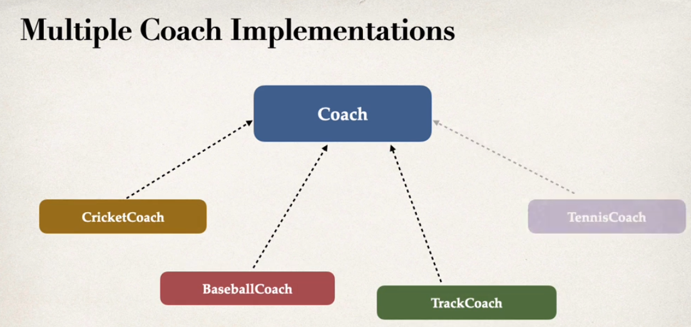

- ## Concept
	- ### What is Inversion of Control (IoC)?
	- ### Dependency Injection
	  id:: 6468d77f-398c-4d6b-9ab2-d506340cd43a
		- #### Constructor injection
			- **How it normally works**
				- create a spring bean using ((6468cd17-958a-4541-9fd0-d096c75d1812))
				- add ((6468cdbc-0dcf-4a8f-998c-03efaeb8fa61)) annotation to the constructor
			-
			- **Behind the scene**
				- [[Spring Boot]] will create a new instance of a default implementation of `Coach` ( `Coach` is the dependency of `DemoController` ) - `CricketCoach`, it also inject the dependency
				- ```java
				  Coach theCoach = new CricketCoach();
				  DemoController demoConroller = new DemoController(theCoach);
				  ```
			-
			- **What Situation to use**
				- When the class have **required dependencies**
				- Recommended by the [spring.io](https://spring.io/) development team
			-
		- #### Setter injection
			- **How it normally works**
				- create a spring bean using ((6468cd17-958a-4541-9fd0-d096c75d1812))
				- add ((6468e144-4914-4bae-aea9-4b4cd0b0fa49)) annotation to the constructor
			- **It can also inject to any method name**
				- ```java
				  @RestController // rest controller
				  public class DemoController {
				  	...
				      @Autowired
				      public void doSomeStuff(Coach myCoach) {
				          this.myCoach = myCoach;
				      }
				  	...
				  }
				  ```
			-
			- **Behind the scene**
				- [[Spring Boot]] will create a new instance of a default implementation of `Coach`(`Coach` is the dependency of `DemoController`) - `CricketCoach`, it also inject the dependency through setter injection.
				- ```java
				  Coach theCoach = new CricketCoach();
				  DemoController demoConroller = new DemoController(theCoach);
				  ```
				- **What Situation to use**
					- When the class have **optional dependencies**
					- **optional dependencies** mean if the dependency is not provided, your app can provide some default logic
					- Recommended by the [spring.io](https://spring.io/) development team
			-
		- #### Field Injection
			- **No longer cool**
				- Field injection was popular on the early days
				- It makes the code harder for unit testing
			-
			- **How it normally works**
				- Inject dependency by setting the field values on the class directly (private fields as well)
				- Accomplished by using [[Java Reflection]]
				- using ((6468e81f-7f9e-4a66-8d7d-8ed04fb523d3))
			-
			- **What Situation to use**
				- When the class have **required dependencies**
				- Not Recommended by the [spring.io](https://spring.io/) development team
		-
		- #### Qualifier
			- **How it works**
				- add `@Qualifier` using ((6468ec48-91d9-4d52-9e54-268ceaae929f)) for constructor injection or ((6468ecae-33a1-4277-8908-212bea9e3754)) for setter injection
			-
			- **What Situation to use**
				- Used when we have multiple implementations
				- 
			-
	- ### Auto configuration
	  id:: 16878a34-21df-4673-972c-2b651eb05550
		- `@EnableAutoConfiguration` enables [[Spring Boot]]'s auto-configuration support
	- ### Component scanning
	  id:: 72a77874-b10a-4e45-ab49-dfc8ef949cbc
		- `@ComponentScan` enables [[Spring Boot]]'s component scanning of **current package** and scan sub-packages recursively
		-
		- By default, [[Spring Boot]] starts component scanning from the **same package** as your main Spring Boot application, and **sub-packages** recursively
		- Implicitly defines a base search package, which means no need to explicitly reference the base package name
		- For other packages to scan by [[Spring Boot]], use ((6468d8c5-9958-43da-84d9-a71ed6dda90a)) to explicitly to list the base packages to can
		-
	- ### Additional configuration
	  id:: 13787f0d-c9cb-4e04-9c30-b5c1d79836b6
		- `@Configuration` enables [[Spring Boot]] to register extra beans with `@Bean` or import other configuration classes
	- ### JPA
- ## Syntax
	- ### `SpringBootApplication`
		- ```java
		  import org.springframework.boot.SpringApplication;
		  import org.springframework.boot.autoconfigure.SpringBootApplication;
		  
		  @SpringBootApplication
		  public class SpringcoredemoApplication {
		  
		  	public static void main(String[] args) {
		  		SpringApplication.run(SpringcoredemoApplication.class, args);
		  	}
		  
		  }
		  ```
		- the `SpringBootApplication` annotation enables ((16878a34-21df-4673-972c-2b651eb05550)), ((72a77874-b10a-4e45-ab49-dfc8ef949cbc)), ((13787f0d-c9cb-4e04-9c30-b5c1d79836b6))
	- ### ((6468d77f-398c-4d6b-9ab2-d506340cd43a))
		- i love porn
		- #### `@Component`
		  id:: 6468cd17-958a-4541-9fd0-d096c75d1812
			- ```java
			  @Component // Mark this class as a spring bean
			  public class CricketCoach implements Coach{
			      @Override
			      public String getDailyWorkout() {
			          return "Practice fast bowling for 15 minutes";
			      }
			  }
			  ```
		-
		- #### `@Autowire` (constructor injection)
		  id:: 6468cdbc-0dcf-4a8f-998c-03efaeb8fa61
			- ```java
			  @Autowired // Inform Spring to inject the required dependency (optional if only 1 constructor)
			  DemoController(Coach myCoach) {
			     // Coach only have 1 child so CricketCoach is injected
			     this.myCoach = myCoach;
			  }
			  ```
		- #### `@Autowire` (setter injection)
		  id:: 6468e144-4914-4bae-aea9-4b4cd0b0fa49
			- ```java
			  @RestController // rest controller
			  public class DemoController {
			      // dependency
			      private Coach myCoach;
			  
			      @Autowired
			      public void setMyCoach(Coach myCoach) {
			          this.myCoach = myCoach;
			      }
			  
			      @GetMapping("/dailyworkout")
			      public String getDailyWorkout() {
			          return myCoach.getDailyWorkout();
			      }
			  }
			  ```
		- #### `@Autowire` (field injection)
		  id:: 6468e81f-7f9e-4a66-8d7d-8ed04fb523d3
			- ```java
			  @RestController // rest controller
			  public class DemoController {
			      
			      @Autowired
			      private Coach myCoach;
			  
			  	// no need for constructors or setters
			    
			      @GetMapping("/dailyworkout")
			      public String getDailyWorkout() {
			          return myCoach.getDailyWorkout();
			      }
			  }
			  ```
		- #### `@Qualifier` (constructor injection)
		  id:: 6468ec48-91d9-4d52-9e54-268ceaae929f
			- ```java
			  ...
			  import org.springframework.beans.factory.annotation.Qualifier;
			  
			  @RestController // rest controller
			  public class DemoController {
			  	...
			      @Autowired
			      public DemoController(@Qualifier("baseballCoach") Coach myCoach) {
			          this.myCoach = myCoach;
			      }
			  	...
			  }
			  ```
		- #### `@Qualifier` (setter injection)
		  id:: 6468ecae-33a1-4277-8908-212bea9e3754
			- ```java
			  ...
			  import org.springframework.beans.factory.annotation.Qualifier;
			  - @RestController // rest controller
			  public class DemoController {
			  	...
			      @Autowired
			      public void setMyCoach(@Qualifier("trackCoach") Coach myCoach) {
			          this.myCoach = myCoach;
			      }
			  	...
			  }
			  ```
		-
	- ### JPA
	- ### ((72a77874-b10a-4e45-ab49-dfc8ef949cbc))
		- #### `scanBasePackages`
		  id:: 6468d8c5-9958-43da-84d9-a71ed6dda90a
			- ```java
			  package com.bedge.springcoredemo;
			  ...
			  
			  @SpringBootApplication (
			      // Explicitly list base packages to scan
			  	scanBasePackages={"com.bedge.springcoredemo",
			                        "com.bedge.util"})
			  public class SpringcoredemoApplication {
			   ...
			  }
			  ```
-