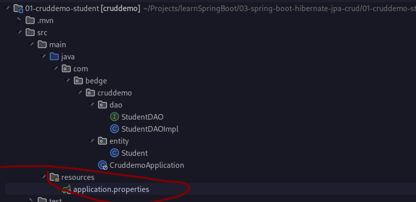

- 
-
-
- ==Turn spring banner==
	- ```properties
	  # Turn off the Spring Boot banner
	  spring.main.banner-mode=off
	  ```
-
- ==Reduce logging==
	- ```properties
	  # Turn off the Spring Boot banner
	  spring.main.banner-mode=off
	  ```
-
- ==Database connection info==
	- id:: 646ce6e5-6aa8-49d3-81d2-eeaa05ddaef2
	  ```properties
	  spring.datasource.url=jdbc:mysql://localhost:3306/student_tracker
	  spring.datasource.username=root
	  spring.datasource.password=root
	  ```
-
- ==Hibernate log info==
	- ```properties
	  # Add logging configs to display SQL statements
	  logging.level.org.hibernate.SQL=debug
	  logging.level.org.hibernate.orm.jdbc.bind=trace
	  ```
-
- ==DDL-auto==
	- ```properties
	  spring.jpa.hibernate.ddl-auto=create
	  ```
	- | Property Value  | Property Description |
	  | `none`| No action |
	  | `create-only` | Database tables are only created |
	  | `drop` | Database tables are dropped |
	  | `create` | Database tables are dropped followed by database tables creation |
	  | `create-drop` | Database tables are dropped followed by database tables creation. On application shutdown, drop the database tables |
	  | `validate` | Validate the database tables schema |
	  | `update` | Update the database tables schema |
	- #+BEGIN_WARNING
	  Can easily drop the PRODUCTION data, only use for **small hobby project**
	  #+END_WARNING